# Cognitive Workspace Canvas Design Reference

この資料から読み取れる主要原則:

- Canvas first: ワークフロー操作面を常に主役にする。
- HUD is layered, not tabbed: HUD は別タブではなく、対象の近くに薄く重ねる。
- Text on demand: 通常時はアイコン・色・形・明滅を優先し、詳細テキストは選択時に出す。
- Normal state stays quiet: 問題がない情報は沈黙させ、未解決・危険・人間判断を前に出す。
- Zoom changes representation: ズーム率に応じて、アイコン俯瞰、カード詳細、浮遊詳細を切り替える。
- Assistant is not just a chat or tab: 状況補佐官はキャンバス上の判断支援レイヤーとして扱う。

## 1. Purpose

この資料は、PR #35 完了後のキャンバス改修イメージと、認知HUD前提のワークスペース設計を視覚的に共有するための設計資料である。

GitHub 上で Issue #34 / PR #35 後の UI 共有資料として参照できるように、チャットで共有されたキャンバス改修後の画面イメージをリポジトリ内に整理して保存する。

## 2. Relation to Issue / PR

- [Issue #31](https://github.com/wit-maker/agent-workflow-studio/issues/31): 認知HUD / 状況説明生成 / 状況補佐官の概念レイヤー補正。
- [Issue #34](https://github.com/wit-maker/agent-workflow-studio/issues/34): panel-first UI から cognitive workflow workspace への UI shell 移行。
- [PR #35](https://github.com/wit-maker/agent-workflow-studio/pull/35): Issue #34 の基礎実装。キャンバス主導の cognitive workspace shell を着地させた PR。

## 3. Design Intent

- panel-first UI から cognitive workspace への転換。
- Canvas first: 画面の中心はワークフローを作る、操作する、走らせる場所。
- HUD as overlay: 状態・判断・注意喚起は別パネルに逃がさず、判断対象の近くへ重ねる。
- Situation / Assistant / Human Review surfaces: 状況補佐官、人間レビュー、認知HUDは単なるタブではなく、キャンバス上の判断支援面として扱う。
- Detail drawer demotion: Detail Drawer / Bottom Monitor は常時主役ではなく、必要時の補助面に下げる。
- Zoom level dependent representation: ズームアウトでは構造と関係、ズームインではカード詳細と局所編集を優先する。
- Multi-workflow handling: 複数ワークフローを同一キャンバスで俯瞰し、関連と切替を扱う。
- inline preview / floating overlay / minimap / HUD layers: ノード上プレビュー、選択時の浮遊詳細、ミニマップ、5層HUDを組み合わせる。

## 4. Image Index

### 01. Game HUD Design Principles

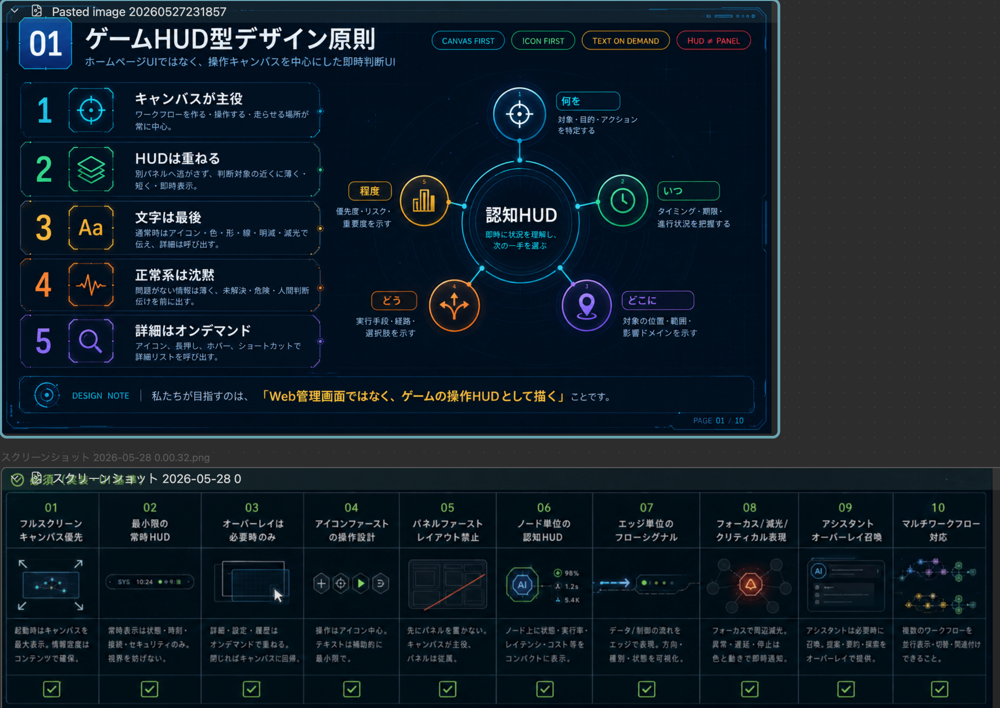

- ゲームHUD型 UI の基本原則を示すボード。
- Canvas first、icon first、text on demand、HUD と panel の分離を前提にしている。
- 実装では常時表示情報を増やすのではなく、キャンバス操作と即時判断を支える最小HUDへ寄せる。

### 02. Do Not Patterns

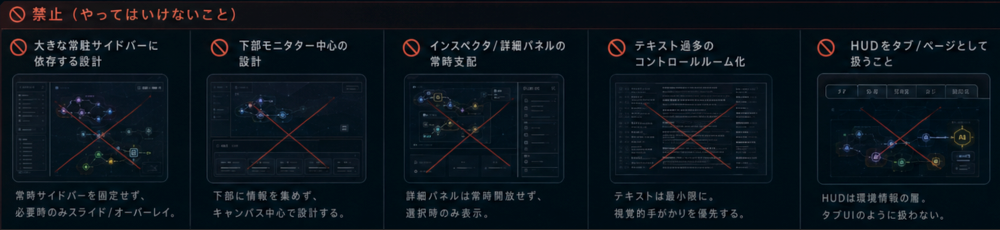

- キャンバス改修で避けるべき UI パターンをまとめた禁止事項。
- 常時サイドバー依存、下部モニター中心、詳細パネル常時支配、テキスト過多、HUD のタブ化を否定している。
- 実装判断で迷った場合は、この画像を「やらないこと」の境界として扱う。

### 03. HUD Layer Model

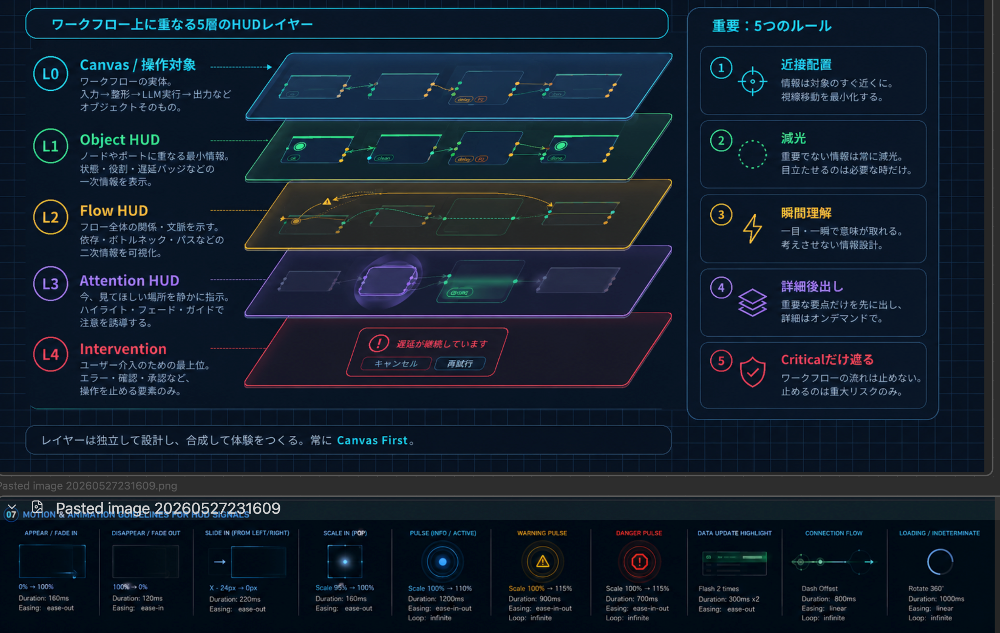

- ワークフロー上に重ねる 5 層の HUD レイヤーを示すモデル。
- L0 Canvas、L1 Object HUD、L2 Flow HUD、L3 Attention HUD、L4 Intervention の役割を分離している。
- 認知HUDを単一パネルではなく、対象・関係・注意・介入の合成レイヤーとして設計するための参照。

### 04. Wireframe Main Canvas

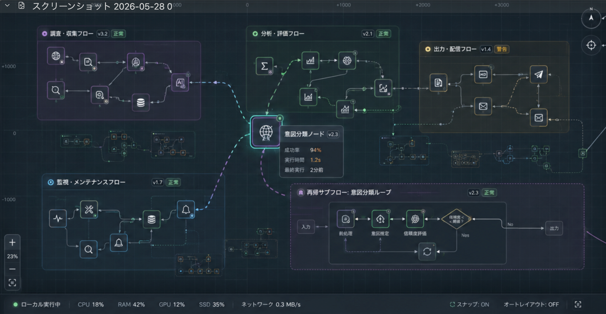

- メインキャンバス全体のワイヤーフレーム。
- キャンバス操作HUD、グローバルHUD、アイコンビュー、カードビュー、オーバーレイパネル、ズーム、ミニマップの配置関係を示す。
- PR #35 後の cognitive workspace shell が目指す全体構成の視覚基準として扱う。

### 05. Wireframe Zoomed-Out Overview

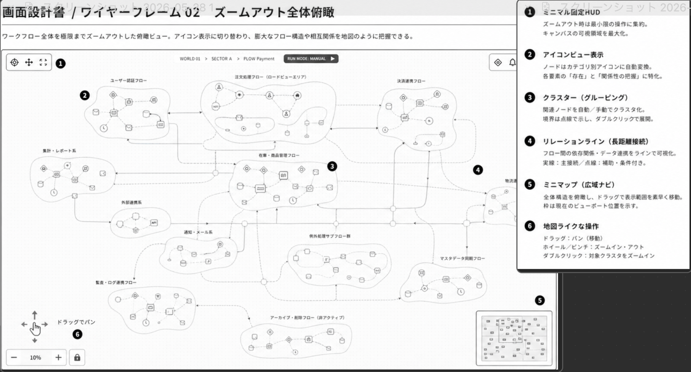

- ズームアウト時の全体俯瞰ビュー。
- ノードを詳細カードではなくアイコンとクラスタで扱い、長距離接続やフロー間関係を地図のように把握する。
- 実装ではズーム率による表現切替と、広域ナビゲーションの設計判断に関係する。

### 06. Wireframe Zoomed-In Card View

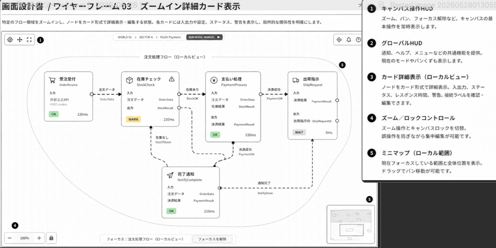

- ズームイン時の詳細カード表示。
- 入出力、ステータス、警告、接続ラベル、局所関係をカード内で確認し、集中編集できる状態を示す。
- 実装ではノードカードの情報密度、ローカルビュー、ズーム / ロック操作の基準になる。

### 07. Node Detail HUD

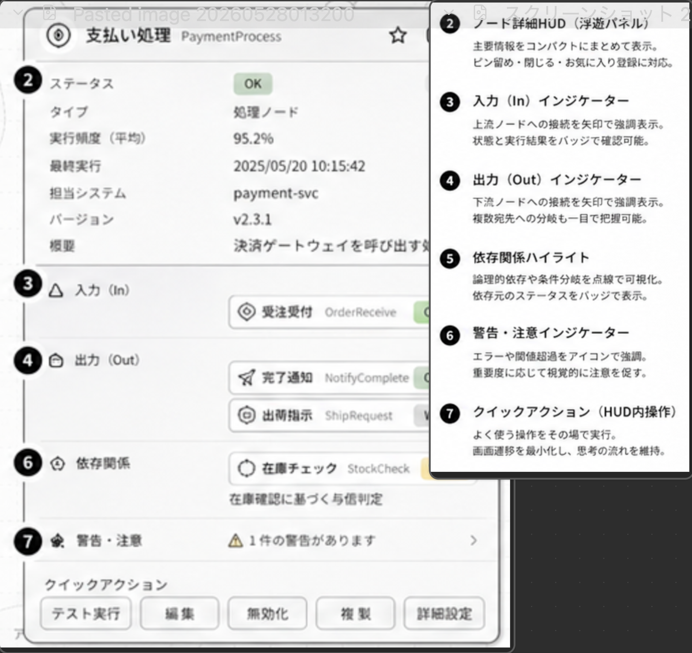

- 選択ノードに対する浮遊型の詳細HUD。
- 状態、入力、出力、依存関係、警告、クイックアクションを対象の近くにまとめる。
- Detail Drawer に閉じ込めず、選択時だけキャンバス上へ詳細を出す設計の参照。

### 08. Minimap / Overview

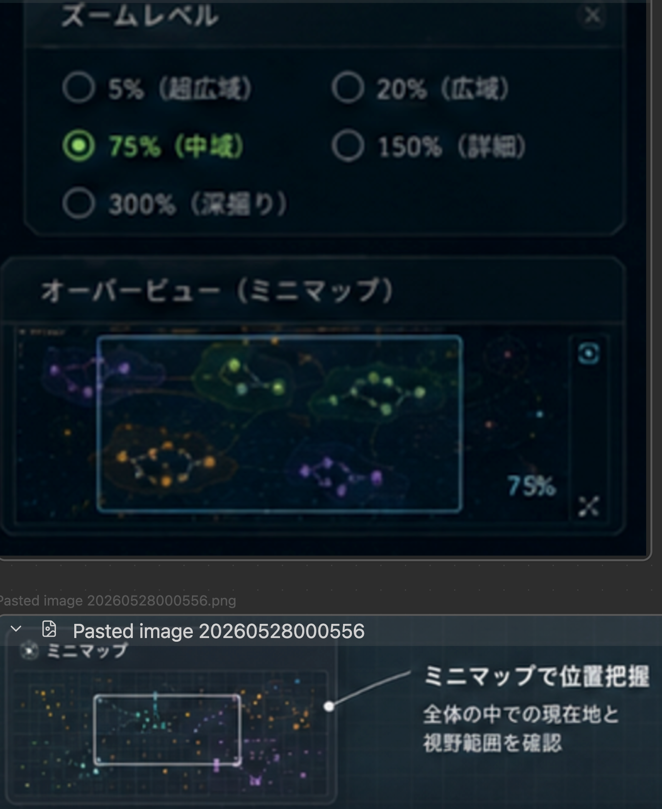

- ミニマップ / オーバービューによる現在地と視野範囲の把握を示す。
- ズームレベル選択、広域ナビ、ビュー範囲表示に対応する操作モード。
- 実装では大きなキャンバス内の位置把握、パン、ズーム、全体俯瞰の UI 設計に関係する。

### 09. Multi-Workflow

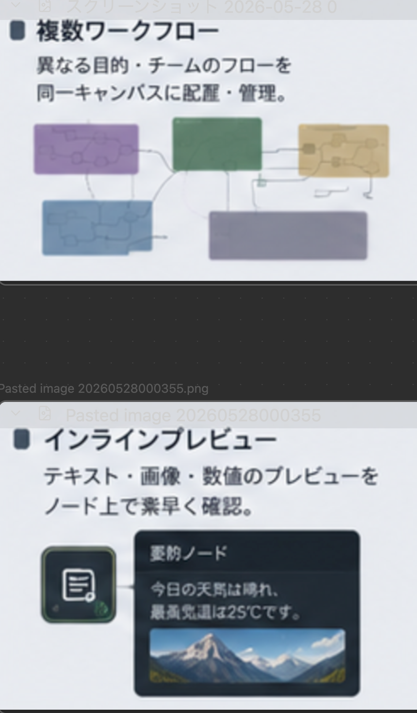

- 複数ワークフローを同一キャンバスに配置・管理する考え方を示す。
- 異なる目的やチームのフローを並べ、関係線や領域で共存させる表示思想に対応する。
- 実装ではワークフロー単位のクラスタ表示、並列管理、関連付けの別 Issue 化候補になる。

### 10. Inline Preview

- ノード上でテキスト、画像、数値などのプレビューを素早く確認する設計。
- 詳細パネルへ移動せず、ノード近傍で情報の意味を把握する on-demand 表示に対応する。
- 実装では成果物プレビュー、データプレビュー、ノードの情報圧縮ルールに関係する。

### 11. Selection Overlay

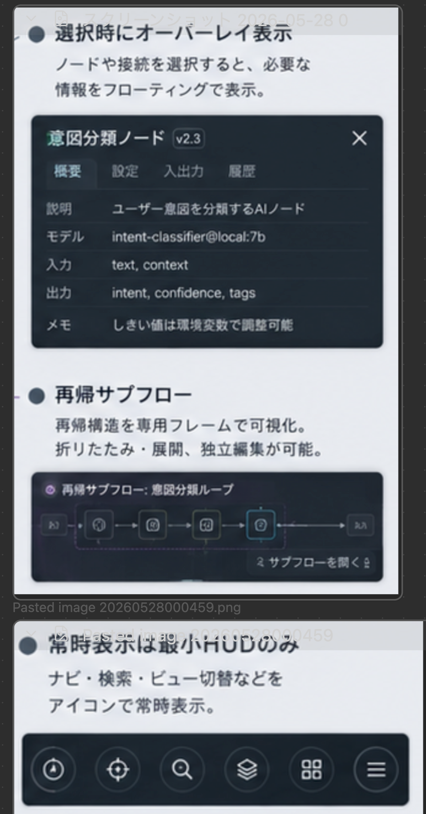

- ノードや接続を選択したときに必要情報を浮遊表示する例。
- 通常時は沈黙し、選択時に概要・設定・入出力・履歴などを前に出す操作モード。
- 実装では選択状態、オーバーレイ表示、詳細表示の出し分けに関係する。

### 12. Minimal Always-On HUD

- 常時表示を最小HUDだけに抑える考え方を示す。
- ナビ、検索、ビュー切替、レイヤー、メニューなどをアイコン中心に残し、キャンバスを圧迫しない。
- 実装では常時表示 UI の上限と、詳細表示を on-demand に逃がす判断基準になる。

### 13. Dark Theme Finished Canvas

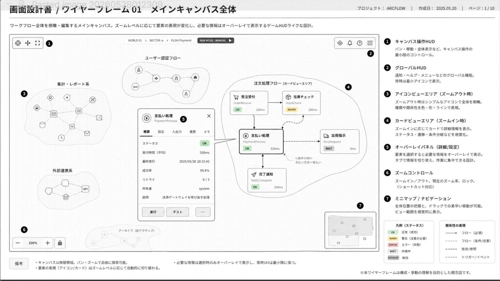

- ダークテーマでの改修後キャンバス完成イメージ。
- 複数フロー、クラスタ、選択ノード、状態バッジ、下部の最小ステータスHUDを統合している。
- 実装と完全一致させるための画像ではなく、PR #35 後の目標体験を共有する視覚リファレンス。

## 5. Key Design Rules Extracted From the Boards

- Canvas first.
- HUD is layered, not tabbed.
- Text on demand.
- Normal state stays quiet.
- Selection reveals overlay details.
- Zoom changes representation.
- Multi-workflow coexistence.
- Minimap / overview navigation.
- Inline preview on node.
- Assistant is not just a chat or tab.

## 6. Notes for Implementers

- これは実装ガイド兼視覚リファレンスであり、ピクセル完全一致の指示書ではない。
- 実装時は Issue #31 / Issue #34 / PR #35 の概念整合を優先する。
- 既存コードとの差分があれば、この資料だけで直接実装せず、設計意図を引用して別 Issue 化する。
- 画像 09 / 10 と 11 / 12 は、それぞれ同じ元画像内に複数テーマが含まれていたため、内容を切り抜かず意味別ファイル名で重複配置している。
- この資料は設計資料であり、現在の実装が全画像内容と完全一致することを保証しない。

## 7. Related Files

- [docs/project/concept-layer-correction.md](../../project/concept-layer-correction.md)
- [docs/audit/technical-debt.md](../../audit/technical-debt.md)
- [docs/audit/current-implementation-map.md](../../audit/current-implementation-map.md)
- [docs/audit/spec-coverage-matrix.md](../../audit/spec-coverage-matrix.md)
- [docs/source-specs/03_UI_UX_認知HUD設計書_完全版.md](../../source-specs/03_UI_UX_認知HUD設計書_完全版.md)
- [Issue #31](https://github.com/wit-maker/agent-workflow-studio/issues/31)
- [Issue #34](https://github.com/wit-maker/agent-workflow-studio/issues/34)
- [PR #35](https://github.com/wit-maker/agent-workflow-studio/pull/35)
